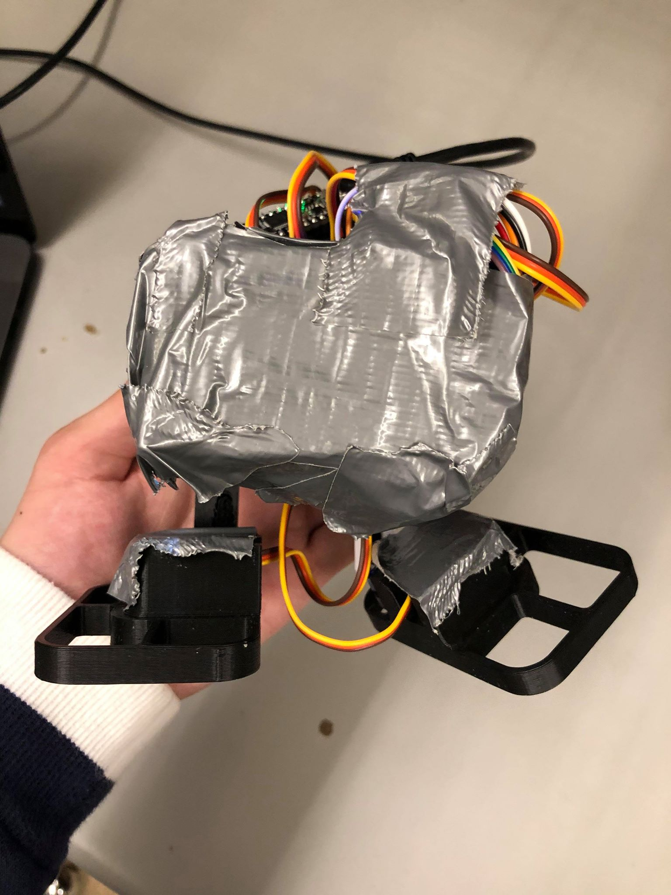

# Bipedal-Dancing-and-Singing-Robot
Welcome to a look into my team's Bipedal Dancing and Singing Robot. This project was built on the Itsy-Bitsy (M2 Express) from Adafruit and
features many amazing functionalities and supports Bluetooth inputs.

Overview:
- The purpose of this project was to highlight and use servos to mimic bipedal motion (legs and feet) for a robot.
- What better way to demonstrate moving feet than dancing!
- Additional features such as a buzzer to play songs (because you can't dance without some music) and a LCD was added to enchance the visual
and appeal of the robot
- Bluetooth functionality was added to control the routines that the robot could perform.

Features:
- Adafruit M.2 Express
- Piezo Buzzer
- 4 Servos
- LCD screen to show images and routine information
- Bluefruit module

Usage and Details:
- The robot when powered on (either through a connection with a laptop or battery pack) would power on and perform all its moves
- When connected to a bluetooth device, the user can download the Bluefruit Application to tell the robot to perform 1 of 4 pre preogrammed
songs and dances
- After completing a routine, the robot will read the next input, and continue with the next input

Images:
Front View of Robot

Side View of Robot

Robot Hardware

RoadMap/Challenges:
- The project was hit with many changes, initially an app was in development but due to the time constraint, the default bluefruit application was used instead (which worked amazingly).
- Initial issues of running servo and buzzer code simultaneously using Circuit Python (which did not support threads) was an issue. A unique solution that used the downtime of the buzzer sound duration to move the servos made it look like they were doing it at the same time (which also helped sync the moves with the music).
- I assumed the role as a delegator and integrated the different functionalities together in a cohesive manner. I also tested code by my fellow contributors, working with them in finding and optimizing them for performance. I learned that I should have been more vocal about my expectations on deadlines and have a better plan working ahead so we had more time to perhaps add an additional feature, or looked into making the robot a little neater.

Credits:
- Huge thanks to wkk0407, GradyThompson, OhmaGiardan, Over-TheRainbow, and solder god ihsan314 for being amazing teammates and for working day and night on making this such a success.
